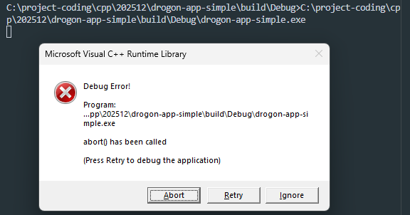

- Setup drogon_ctl
```shell
vcpkg install drogon[core,ctl]:x64-windows
```

- Add all paths to system environment PATH
```
C:\dev\vcpkg\installed\x64-windows\tools\drogon
C:\dev\vcpkg\installed\x64-windows\bin
C:\dev\vcpkg\installed\x64-windows\lib
C:\dev\vcpkg\installed\x64-windows\include
C:\dev\vcpkg\installed\x64-windows\share
C:\dev\vcpkg\installed\x64-windows\debug\bin
C:\dev\vcpkg\installed\x64-windows\debug\lib
```

- Create project
```shell
drogon_ctl create drogon-app-simple
```

- Configure, Build, Run!
    - Choose configure preset: windows-base
    - Configure, Build, Launch
        - Note: using Build type as Debug doesn't work!
        - 

- To open with index.html
```bash
cd public/ # call the exe from the folder which has index.html in it
../build/windows-base/Release/drogon-app-simple.exe
```

---

Reference: [Article: Install by vcpkg in Windows](https://drogonframework.github.io/drogon-docs/#/ENG/ENG-02-Installation?id=install-by-source-in-windows)