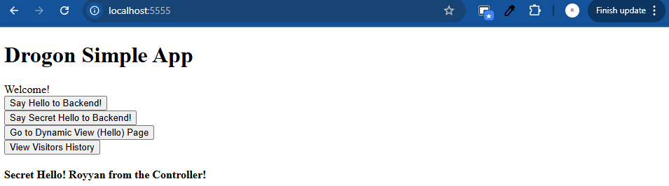
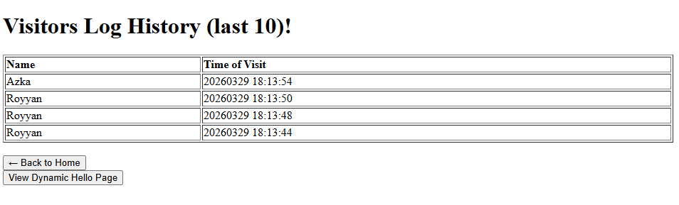

# Drogon Visitors Log App

Creating Drogon application based on modern C++23

Try `/hello/your_name`!

Future developments: [DEVELOPMENT.md](DEVELOPMENT.md)

## Features
- no vcpkg
- Public index.html
- config.json: set port
- Controllers
- Filters
- Dynamic Views
	- Table Row of Logs
- Centralized `bin/` folder
- .vscode/settings.json: for better includePath of `<drogon.h/...>`
- .vscode/launch.json: for better debug launcher
- Naming files as `.cc` and `.h` (drogon convention)
- CMakePresets: msvc, clang, clang on linux

## Screenshots

